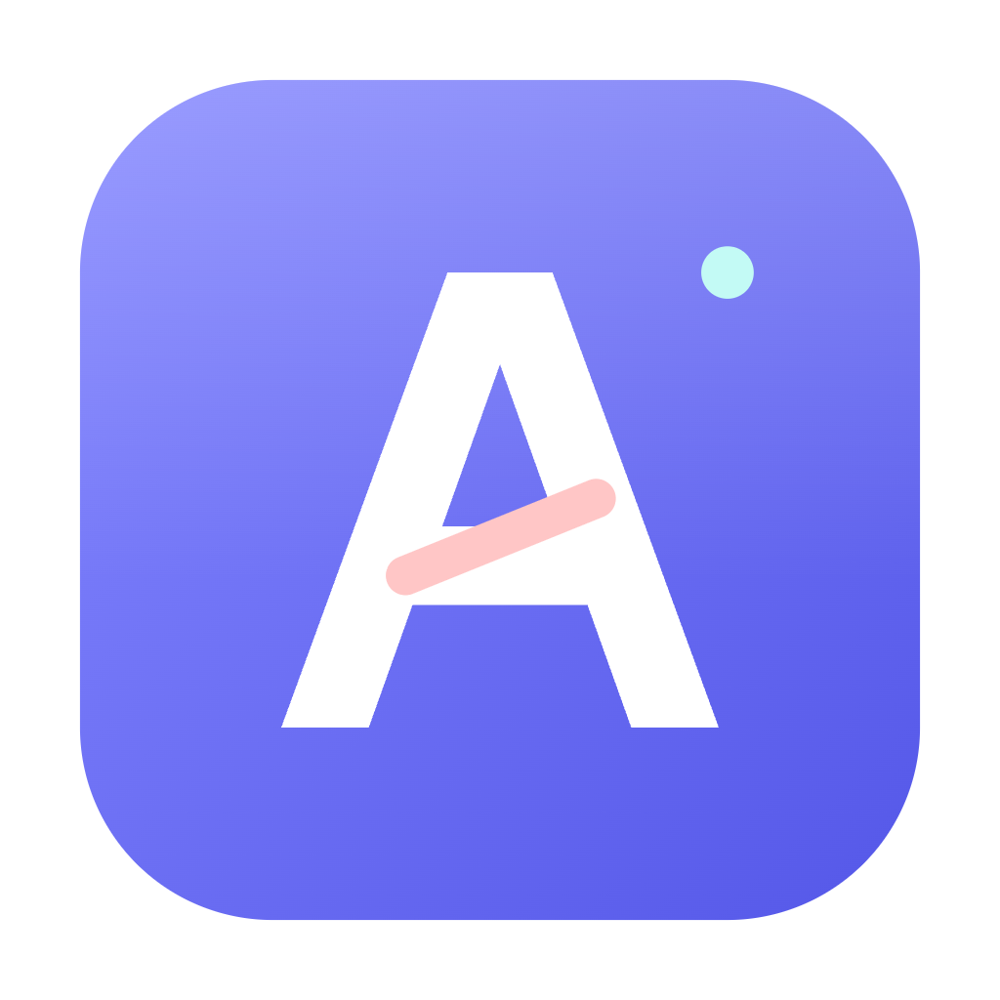

<div align="center">



# Atrium

Atrium is a local-first desktop AI agent assistant. Connect to any model provider with your
own key, with all the AI-agent capabilities you'd expect today.

[English](./README.md) · [简体中文](./README.zh-CN.md) · [Download](https://github.com/lhz960904/atrium/releases/latest)

[](./LICENSE)
[](https://github.com/lhz960904/atrium/releases/latest)
[](https://github.com/lhz960904/atrium/releases)

</div>

## Demo

https://github.com/user-attachments/assets/49af7cb9-f11c-4cce-8fd8-c45e3dcbbd8f

## Features

- **Multi-provider:** Anthropic, Google Gemini, any OpenAI-compatible endpoint, local models
  via Ollama, and external CLI agents (Claude Code, Codex, Gemini CLI) — all with your own
  keys, encrypted on-device.

- **MCP:** connect Model Context Protocol servers (stdio / HTTP / SSE) and use tools from
  third-party services right inside a conversation. Import directly from popular tools, with
  OAuth authorization for third-party services.

- **Skills:** package reusable procedures into skill bundles (`SKILL.md` and friends) that
  are progressively disclosed to the agent. Read existing skills from multiple sources —
  Claude Code, Codex, .agents — and automatically track usage frequency to filter out
  unhelpful skill descriptions.

- **Subagents:** split a large task into subtasks delegated to focused agents that run in
  isolated context and report back, without polluting the main agent's context. Create and
  delete subagents as needed.

- **Cross-session memory:** onboards your identity (the `get-acquainted` skill) and writes
  memory automatically as you talk, with distinct global and project-scoped memory that
  persists. Background summarization keeps memory high-quality over the long term.

## Architecture

The renderer talks to the main process two ways: tRPC over Electron IPC for CRUD and config,
and an HTTP stream from a localhost server for chat. The AI agent loop, storage, and provider
resolution all live in the main process.

<div align="center">
  
</div>

## Quick Start

**Prerequisites:** [Bun](https://bun.sh/) and a C/C++ toolchain for the `better-sqlite3`
native build (Xcode Command Line Tools on macOS, `build-essential` on Linux, the Visual
Studio C++ workload on Windows).

```bash
git clone https://github.com/lhz960904/atrium.git
cd atrium
bun install        # install deps; postinstall rebuilds native modules for Electron
bun run dev        # launch Electron + Vite with HMR
```

On first launch, open **Settings → Providers**, enable a provider, and paste in your API key
(it is encrypted with your OS keychain and stored locally).

Other common scripts:

```bash
bun run check      # biome (lint + format) + tsc typecheck — run before every commit
bun test           # unit tests
bun run build      # typecheck + bundle into out/
bun run build:mac  # package a .dmg (also build:win / build:linux)

# Database schema lives in src/main/db/schema.ts:
bun run db:generate   # emit a migration into drizzle/migrations/*.sql
bun run db:push       # push schema straight to dev.db
bun run db:studio     # browse dev.db in Drizzle Studio
```

## Issues & PRs

Contributions are welcome.

- **Found a bug or have an idea?** Open an
  [issue](https://github.com/lhz960904/atrium/issues/new/choose).
- **Sending a pull request?** Branch off `main`, make sure `bun run check` and `bun test`
  pass. See [CLAUDE.md](./CLAUDE.md) for the project's engineering principles.

## License

[MIT](./LICENSE) © lhz960904
