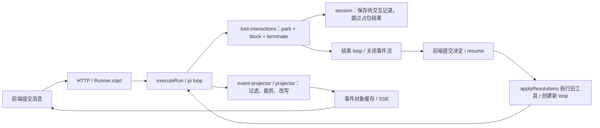
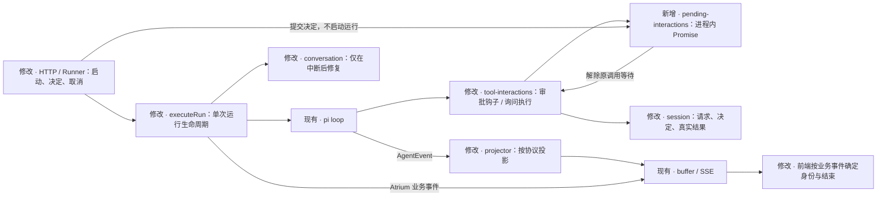

# Agent Runtime：连续交互与事件投影

## 概述

审批和询问是一次运行中的等待，不是一次运行的结束。进程仍在运行时，用户提交决定只解除原调用的等待，由原来的 pi loop 继续执行；退出、取消和崩溃才进入中断收尾或历史修复。

事件流是主进程到 renderer 的传输投影，不是 pi 事件的逐字镜像。投影只做有明确理由的负载删减（累计的 partial / message，以及 turn_end、agent_end 里重复送达的内容），事件类型从 pi 包类型派生而不是手抄。投影不伪造生命周期、不复制字段：运行身份由 Atrium 的 run_started 携带，应用收尾由 run_finished 表示，交互请求是独立业务事件，工具错误文字由消费者从 content 提取。

本方案基于 `f5dd546`：capabilities 集中注册与 `execute-run.ts` / Runner 重构已经提交，实施在其上继续。Provider 相关改动不在本次范围。

已确认的交互策略：

- 等待用户决定不设超时，直到用户决定、停止或进程退出。本轮不实现超时参数，等有设置入口时再加。
- 等待交互期间线程保持占用：用户必须先批准、拒绝、回答或停止，才能发送新消息。现有 `ChatThread.tsx` 已在有待审批 / 待回答时占用 composer，本方案沿用；不做“发送新消息即拒绝当前交互”。
- 定时任务也保留等待，允许用户稍后打开绑定会话处理；不自动批准，不因为暂时没有前端订阅者而失败。
- 不做旧版协议、旧 `/resume` 写接口或跨版本待审批任务的兼容执行。保留现有已完成会话数据，不重置用户数据库。
- 保留当前审批、询问和工具卡片的视觉布局；本次改变其数据与运行生命周期，不另做 UI 设计。

## 当前流程



当前投影删掉累计的 partial / message，让每帧只和增量大小有关（`shared/protocol/events.ts` 头注释），这一点保留。需要修的是三处：`message_start/end` 附加的 messageId 实际等于 runId；pi 的 `agent_end` 被吞掉，再由应用收尾伪造一个；工具错误由 `stream/tool-result.ts` 复制到 `details.errorText`，实时卡片和历史视图都读这份副本。

## 目标流程



## 关键技术决策

### 所有权与正常路径

| 决策 | 现状与证据 | 选择、理由和取舍 |
|---|---|---|
| 同一 loop 等待 | pi 0.84.2 的 `beforeToolCall` 返回 Promise，内部直接 await；`dist/types.d.ts:232`、`dist/agent-loop.js:405` | 审批在 beforeToolCall 内 await；批准返回 undefined；拒绝返回 block + reason，不默认 terminate。保留进程内运行资源，换取正常路径不重建上下文和工具。 |
| 询问也使用真正的工具执行 | `src/main/agent/tools/builtins/ask-clarification.ts` 目前 execute 只会抛错，依赖 clientSide 标记 | 在询问工具 execute 内 await，答案成为真实工具结果。不能把答案塞进只能决定是否放行的 beforeToolCall 返回值。 |
| 集中登记能力 | `capabilities/tool-interactions.ts` 已是交互注册点 | 该能力负责审批判断、请求/决定持久化、业务事件，并暴露一个给询问工具使用的 ask 方法。新增的 `pending-interactions.ts` 只管理等待与决策竞争，不访问 DB，也不是通用中间件框架。 |
| Runner 的边界 | 当前 Runner 已只管理 active、取消和缓冲区 | Runner 为每个 run 创建一个待决请求表，负责按 threadId/runId 投递决定；executeRun 负责 session、工具和能力装配。HTTP 不读 DB、不执行工具、不重建 Agent。 |
| 消息身份 | `pi-chat/store.ts` 用消息 ID 合并历史；目前它等于 runId | 删除 pi 消息上的 messageId；每条运行流的首个 Atrium `run_started` 业务事件携带 runId。一个 run 仍对应前端一条 assistant 回复，多个 pi turn 是其中的步骤。 |
| 运行结束 | `execute-run.ts` 在用量、录制和资源收尾后手工发 agent_end | pi 的 agent_end 只表示 loop 结束，按协议投影后转发，不再伪造；`run_finished` 才表示应用收尾已完成。准备阶段失败时允许没有 agent_start/end，但必须有失败的 run_finished。 |
| 线上负载 | pi 每个 message_update 同时带 `message` 与 `assistantMessageEvent.partial` 两份累计内容（`dist/agent-loop.js:222`）。按 50 KiB 回复估算，1,000 个增量原样转发约 49 MiB、现投影约 0.18 MiB；token 粒度 12,800 个增量约 634 MiB、现投影约 1.7 MiB | 保留投影：累计 partial / message、turn_end 的 message/toolResults、agent_end.messages、done/error 的最终消息不上线；user / toolResult 的消息事件不上线（用户消息来自请求体，工具结果由 tool_execution_end 送达）。缓冲区保存方式不变。 |
| 事件类型 | `shared/protocol/events.ts` 手抄了 pi 事件形状，pi 升级时会漂移 | 事件类型用 type-only import 从 pi 的 `AgentEvent` / `AssistantMessageEvent` 派生，只在派生处声明删减。消息与内容词汇仍用 `messages.ts`：其 Content 放宽是为保留未知内容块的有意偏差，本次不改。不把 pi 运行时代码打包进 renderer。 |

### 交互身份、接口与安全

每个请求有服务器生成的 interactionId，绑定 runId、原始 ToolCall 和交互类型。前端只能提交决定，不能替换工具名、参数、模型或执行目录。

新 `POST /api/chat/:threadId/decisions` 每次处理一个请求：

```ts
type DecisionBody = {
  runId: string;
  interactionId: string;
  decision:
    | { kind: 'approved' }
    | { kind: 'denied'; reason?: string }
    | { kind: 'answered'; answers: string[] }
    | { kind: 'cancelled' };
};
```

- approved / denied 只适用于审批；answered / cancelled 只适用于询问。答案按原问题顺序提交，服务端恢复问题文字，不能信任前端自带的问题或工具结果。
- 继续使用本机 token 校验。Zod 严格校验结构、字符串长度和答案个数；请求体上限 64 KiB，原因最长 2,000 字符，每个答案最长 8,000 字符。问题最多四个，具体答案数量须匹配该请求的原始 questions。
- 返回 `202 { status: 'accepted' | 'already_accepted' }`：表示进程内已经接纳决定，不表示工具已执行或结果已落盘。落盘成功后发送 interaction_resolved；之后才放行工具。写入失败就停止运行，绝不执行已批准但未成功记录决定的工具。
- 同一运行中相同决定重试返回 already_accepted；不同决定竞争返回 409，首次有效决定获胜。已结束的请求、已关闭运行、runId 不匹配或不存在的 interactionId 返回 409；非法类型/答案返回 400；未认证返回 401。迟到请求不能创建运行。
- `/resume` 写接口删除。GET pi-events 的“恢复”只指事件重连，与恢复工具执行无关。
- 批准与停止竞争需要同步抢占状态；Promise 只能 settle 一次。批准已接纳后若 run 被取消，仍不能执行工具。

### 状态、持久化与失败

待决表仅在内存里保存 Promise 和 resolver。会话用 pi 的 custom entry 保存请求及终态，类型为 `atrium.interaction`；用 `atrium.run_stop` 保存已知停止原因。无需增加 SQL 表或绕过 Session 写入。

| 场景 | 运行行为 | 记录与下一次输入 |
|---|---|---|
| 等待决定 | run 活跃，Promise 未完成，不制造 toolResult | 请求已持久化，可由 SSE 重放恢复卡片 |
| 批准 | 原调用放行，由 pi 执行 | 保存决定，然后保存 pi 真正产生的结果 |
| 拒绝 | 原调用被阻止，pi 生成带拒绝原因的错误结果；允许模型继续解释 | 保存拒绝决定，不复制错误到 details |
| 取消询问 | 原询问得到 cancelled 结果，同时取消本轮，不再请求模型 | 记录 clarification_cancelled；已完成的工具结果保留 |
| 点击停止 | 取消所有待决请求、传播 abort、清理监听 | 记录 user_cancelled；只补实际缺失的结果 |
| 前端离开、断流 | 不取消 run，不解除 Promise | 重连只重放，不重新执行 |
| 正常退出 | 拒绝新运行，停止调度，中止运行，有界等待收尾再关库 | 尽量记录 app_shutdown；退出等待上限建议 3 秒 |
| 强杀 / 崩溃 | Promise 随进程消失，不恢复执行栈 | 下次启动运行前修复旧缺口；未知原因只能记 interrupted |

请求登记顺序固定为：先在待决表占位 → await 保存 requested entry → 发布 interaction_requested → await 决定 → await 保存 resolved entry → 发布 interaction_resolved → 原调用继续。登记失败必须撤销等待；取消发生在登记期间也必须正常清理，不能产生未处理的 Promise rejection。

用户决定和“工具是否执行成功”是两件事：崩溃前即使记录了批准，也不能据此重执行有副作用的旧工具。恢复时若没有结果，只能说“执行中断，结果未知”；仍处于待审批的调用则可明确说明“审批已失效，未执行”。修复使用原 toolCallId，不新增虚构调用。

pi 在 beforeToolCall 返回后若发现 signal 已取消，会生成通用 `Operation aborted`。不为展示具体 reason 改写这条原生事件；精确原因保存在 Atrium 的交互终态和 run_finished / session 记录中。

### 并发、调度与资源

pi 的默认 parallel 模式（`dist/agent.js:134`）先逐个完成整批工具的 preflight，全部结束后才用 Promise.all 开始执行已放行的工具（`dist/agent-loop.js` 的 executeToolCallsParallel）。因此同一批次里审批逐个出现，并且已批准的工具要等同批其余审批都有结论才开始执行：用户批准后可能暂时看不到执行。本轮接受这一行为，不改 pi 的调度，列入评审重点。

取消的安全补充：这个实现可能在中止 preflight 后仍调用此前已准备好的工具。所有当前内置与 MCP 工具都通过 `tools/define.ts` 的 defineTool 创建；在那里统一增加“execute 入口检查 signal”的保护，防止未开始的工具在取消后产生副作用。已经执行中的副作用不能靠 Promise 回滚，不能承诺跨崩溃 exactly-once。

定时任务保持同一条活跃运行，继续占用该会话的运行槽；现有调度器不得为同一任务启动重叠执行。需要调整现有 `blockSuspension()`：有待交互请求时释放防休眠锁，全部解决且任务继续执行时再获取，避免默认无限等待导致机器一直不能休眠。这是本方案建议的资源策略，列入评审重点。

定时任务通过 RunHandle 的事件订阅读取相同业务事件，不另做“只给 UI 用”的审批通道。新增订阅只用于观察；持久化仍是 executeRun 的 awaited recorder，不转移到异步观察者里。现有 subagent 的询问工具禁用规则保留，不新增子 Agent 交互转发能力。

### 传输投影

线上事件保留现有投影，理由见上表的负载估算。缓冲区策略不变：每线程一个日志、完成日志最多 64 个、发送时序列化。投影规则写在 `shared/protocol/events.ts` 的派生类型旁边，改规则必须同时改类型。

S-002 只修投影里与事实不符的部分：messageId、伪造的 agent_end、details.errorText。进程内观察者（定时任务）与 SSE 收到同一批事件对象，类型为只读，不另做快照。

## 实施步骤

每一步前后端一起切换并保持仓库可运行。下列新接口都是拟新增的应用接口，不是声称 pi 已提供的 API。片段只保留与本次决策相关的控制流；实施时复用现有工具 schema、Session 和测试 fixture。

### S-001 — 审批和询问在同一个 loop 中完成

先用真实 pi + SQLite 的运行测试锁住“决定前运行不结束，决定后原工具只执行一次”；再实现单个待决表，连接现有能力、工具、录制器和 HTTP，最后一起切换前端和定时任务。此步仍使用现有事件编码，投影修正在 S-002；但待审批不再产生占位错误。

#### `src/shared/interactions.ts`（新增）

这里定义 Atrium 自己的交互，而不是复制 pi 工具结构。输入使用严格 Zod schema，输出类型从 schema 推导；InteractionRequest 直接携带原生 ToolCall。

```ts
import type { ToolCall } from '@earendil-works/pi-ai';
import { z } from 'zod';

export const interactionDecisionSchema = z.discriminatedUnion('kind', [
  z.object({ kind: z.literal('approved') }).strict(),
  z.object({ kind: z.literal('denied'), reason: z.string().max(2000).optional() }).strict(),
  z.object({ kind: z.literal('answered'), answers: z.array(z.string().max(8000)).min(1).max(4) }).strict(),
  z.object({ kind: z.literal('cancelled') }).strict(),
]);
export const decideInteractionSchema = z.object({
  runId: z.string().min(1),
  interactionId: z.string().uuid(),
  decision: interactionDecisionSchema,
}).strict();
export type InteractionDecision = z.infer<typeof interactionDecisionSchema>;
export type DecideInteraction = z.infer<typeof decideInteractionSchema>;
export type RunStopReason =
  | 'user_cancelled' | 'clarification_cancelled' | 'app_shutdown' | 'interrupted';
export type InteractionOutcome = InteractionDecision | { kind: 'interrupted'; reason: RunStopReason };
export type InteractionRequest = {
  id: string;
  runId: string;
  kind: 'approval' | 'clarification';
  toolCall: ToolCall;
  createdAt: number;
};
export type InteractionEvent =
  | { type: 'interaction_requested'; request: InteractionRequest }
  | { type: 'interaction_resolved'; request: InteractionRequest; outcome: InteractionOutcome };
```

`shared/protocol/events.ts` 此步仅把旧 approval_requested / approval_resolved 扩展替换为 InteractionEvent，并移除旧 ToolDecision；其余投影修正留待 S-002。`shared/protocol/index.ts` 仅增加类型导出。

#### `src/main/agent/runtime/pending-interactions.ts`（新增）

Runner 每个 run 创建一个实例，传入该 run 的 AbortController。不依赖 Electron、DB 或前端。方法登记请求、竞争决定并清理资源；终态接纳记录只保留到本次 run 结束，用于相同决定重试。

```ts
export function createPendingInteractions(opts: {
  runId: string;
  abort: AbortController;
}): PendingInteractions {
  // PendingInteractions 的公开方法见返回值；entries 内保存 request、settle、timer、detach。
  const entries = new Map<string, PendingEntry>();
  const accepted = new Map<string, InteractionDecision>();
  let failure: Error | undefined;

  return {
    get failure() { return failure; },
    open(kind, toolCall) {
      // 创建 request 和带取消处理的 response；登记后才允许调用方发布 requested。
      // 已取消时不得留 pending；取消返回 interrupted，并清理全部资源。
      return createEntry(entries, opts, kind, toolCall);
    },
    respond({ runId, interactionId, decision }) {
      // 先校验 runId、存活状态、请求类型、原始问题和答案数量。
      // 已接纳同一决定返回 already_accepted，不同决定或已结束的请求抛 409。
      // 在任何 await 之前从 pending 转入 accepted，然后 settle；不能执行工具。
      return acceptDecision(entries, accepted, opts, runId, interactionId, decision);
    },
    cancel(reason: RunStopReason | Error) {
      if (reason instanceof Error) failure ??= reason;
      opts.abort.abort(reason);
    },
    dispose() {
      // 撤销未完成等待并清理监听；清空 accepted，不持久化 resolver。
      closeEntries(entries);
      accepted.clear();
    },
  };
}
```

`open` 返回 `{ request, response, cancel }`。cancel 用于“请求保存失败”的局部撤销；全 run 取消通过 cancel(reason)。respond 接纳 cancelled 时，先 settle 该询问，再同步取消整个 run，防止另一个工具继续进入执行。停止原因以 run 的原始 AbortSignal.reason 为准，不依赖 pi 转发后可能丢失的 reason。Error 表示内部执行故障而非用户取消；待决表暴露只读 failure，记住首个内部故障，避免已经发生用户取消时 AbortSignal.reason 无法再次更新而吞掉持久化失败。

#### `src/main/agent/runtime/capabilities/tool-interactions.ts`

一个能力拥有完整交互流程。审批在 beforeToolCall 中等待；ask 交给询问工具的 execute。请求/决定先记录后发布，数据库故障不能被当作批准。gate 不变，包括已有 trust rules 与自动审核。

```ts
export function toolInteractions(opts: {
  gate: ReturnType<typeof approvalGate>;
  pending: PendingInteractions;
  recorder: SessionRecorder;
  emit: (event: AgentSessionEvent) => void;
  signal: AbortSignal;
}) {
  async function request(kind: InteractionRequest['kind'], call: ToolCall) {
    const waiting = opts.pending.open(kind, call);
    try {
      await opts.recorder.interactionRequested(waiting.request);
      opts.emit({ type: 'interaction_requested', request: waiting.request });
      const outcome = await waiting.response;
      await opts.recorder.interactionResolved(waiting.request, outcome);
      opts.emit({ type: 'interaction_resolved', request: waiting.request, outcome });
      return outcome;
    } catch (error) {
      waiting.cancel();
      opts.pending.cancel(error instanceof Error ? error : new Error(String(error)));
      throw error;
    }
  }
  return {
    name: 'tool-interactions',
    beforeToolCall: async ({ toolCall, args }) => {
      if (!(await opts.gate(toolCall.name, args, toolCall.id))) return;
      const decision = await request('approval', toolCall);
      // 检查原始 signal，防止批准接纳后又被取消；不在这里执行工具。
      opts.signal.throwIfAborted();
      if (decision.kind === 'approved') return;
      if (decision.kind === 'denied') return { block: true, reason: decision.reason ?? 'The user denied this operation. Do not retry it.' };
      throw new Error('Approval did not complete');
    },
    ask: async (call, signal) => {
      signal?.throwIfAborted();
      const outcome = await request('clarification', call);
      // 按原 questions 重建 ClarifyResult；明确取消返回 cancelled:true，其他中断抛出带原因的错误。
      return clarificationResult(call, outcome);
    },
  };
}
```

#### `src/main/agent/tools/builtins/ask-clarification.ts`

保留现有参数 schema。移除 clientSide 标记，execute 返回原生工具结果；未装配 ask 的工厂可用于 schema 测试，但执行会明确报 unavailable，不自行寻找全局 Runner。

```ts
// 工厂新增可选 ask 参数，类型从 ToolCtx['ask'] 复用。
execute: async (toolCallId, args, signal) => {
  if (!ask) throw new Error('User interaction is unavailable in this context.');
  return ask({ type: 'toolCall', id: toolCallId, name: 'ask_clarification', arguments: args }, signal);
},
```

`src/main/agent/tools/context.ts` 增加 `ask?: (call: ToolCall, signal?: AbortSignal) => Promise<AgentToolResult<ClarifyResult>>`，使用包类型和已有 ClarifyResult。`src/main/agent/tools/registry.ts` 仅将 `askClarificationTool()` 改为 `askClarificationTool(ctx.ask)`。不把 resolver 或 DB 写入能力暴露给工具。

#### `src/main/agent/tools/define.ts`

移除 clientSide 扩展，AtriumTool 直接别名 AgentTool。统一工具执行入口的取消检查，覆盖内置和通过同一工厂生成的 MCP 工具；工具已经启动后的取消仍由各工具实现负责。

```ts
export type AtriumTool<P extends TSchema = TSchema, D = unknown> = AgentTool<P, D>;

export function defineTool<P extends TSchema, D>(tool: AtriumTool<P, D>): AtriumTool {
  return {
    ...tool,
    execute: async (...args: Parameters<typeof tool.execute>) => {
      args[2]?.throwIfAborted();
      return tool.execute(...args);
    },
  } as unknown as AtriumTool;
}
```

#### `src/main/agent/runtime/execute-run.ts`

去掉 parked、resumeRunId、resolutions、applyResolutions；待交互不再是 RunResult 的终态。prepareRun 调整为先构建 gate，再构建交互能力和工具；能力只注册一次，ask 只接到询问工具。prepareMessages 只负责正常历史与压缩。

```ts
// ExecuteRunOptions 新增 pending，signal 继续使用该 run 的原始 signal。
const session = await openThreadSession(db, input.threadId, workspaceRoot);
const recorder = createSessionRecorder({ session, runId });
await recorder.begin(prompt);
// prepareRun 内已有 ctx、gate、工具依赖；这里展示新的装配顺序。
const interactions = toolInteractions({ gate, pending: opts.pending, recorder, emit, signal });
const tools = getTools({ ...toolContext, ask: interactions.ask });
const capabilities = [/* 保留已存在的上下文、scope、loop detection */ interactions];
const loop = createAgentLoop({ /* 保留 model / system / messages / tools */ ...composeCapabilities(capabilities) });
loop.subscribe(createRunEventProjector({ runId, emit })); // 投影修正见 S-002。
loop.subscribe(recorder.observe);
await loop.run(signal);
// 先检查 pending.failure，存在则 result=failed；之后才按 signal 判断 aborted。
// pi 会把钩子抛错转成工具错误，不能仅靠 throw 让整个 run 失败。
// 原有独立收尾仍执行；pending.dispose 放 finally，waiting 不再跳过 recorder.end。
```

`stream/event-projector.ts` 此步删除 parked 检查，仅保留角色过滤与错误提取；暂时仍需 runId 提供旧 messageId，装配调用保留 `{ runId, emit }`。S-002 把剩下的角色过滤并入 `projector.ts` 后删除此文件。

#### `src/main/agent/runtime/runner.ts`

active 项持有 runId、AbortController、pending、settled 和只读事件订阅。审批响应只路由到已有实例。所有入口复用同一个 active 校验；等待时不能再次 start，也不能并行 compact 该线程。

```ts
type ActiveRun = {
  runId: string;
  abort: AbortController;
  pending: PendingInteractions;
  settled: Promise<RunOutcome>;
};

function respond(threadId: string, input: DecideInteraction) {
  const run = active.get(threadId);
  if (!run || run.runId !== input.runId || run.abort.signal.aborted) {
    throw new InteractionConflict('The interaction is no longer active.');
  }
  return run.pending.respond(input);
}

function abort(threadId: string): boolean {
  const run = active.get(threadId);
  if (!run) return false;
  run.pending.cancel('user_cancelled');
  return true;
}
```

start 仍同步校验模型并返回 RunHandle，不等待审批。删除 resume / settle。RunHandle 增加 `subscribe(listener): () => void`：与传输相同的投影事件和业务事件，类型只读，只接收订阅之后的事件；不取代 recorder；观察者抛错只记录日志，不使已保存的决定回滚。事件订阅在 start 返回后的异步执行开始前可建立；请求必须先经过异步 session 装配。完成后清理观察者。

#### `src/main/conversation/session-recorder.ts`

移除 resuming / park / parked set；所有 pi message_end 的真实 toolResult 都正常记录。用已有 Session.appendEntry 写交互请求及终态。每个请求只写一次 requested、一次 resolved，由待决表只 settle 一次保证；Entry ID 按 interactionId + 阶段生成便于读取，但 pi 对重复 id 抛 `SessionError`（code `already_exists`），不能把稳定 ID 当作去重。

```ts
async function interactionRequested(request: InteractionRequest): Promise<void> {
  await session.appendEntry({
    id: `${request.id}:requested`, type: 'custom', customType: 'atrium.interaction',
    data: durable({ phase: 'requested', request }),
  }, 'main');
}

async function interactionResolved(request: InteractionRequest, outcome: InteractionOutcome): Promise<void> {
  await session.appendEntry({
    id: `${request.id}:resolved`, type: 'custom', customType: 'atrium.interaction',
    data: durable({ phase: 'resolved', request, outcome }),
  }, 'main');
}
```

#### `src/main/conversation/project.ts`

按 custom entry 顺序折叠 requested/resolved，而不是见过审批标记就永远显示待批。只有未解决请求可以恢复为交互卡片，拒绝、取消、中断必须恢复为终态。工具成功/失败仍以真实 toolResult 为准。

```ts
function toolStatesOf(entries: Entry[]): Record<string, unknown> {
  const states = new Map<string, InteractionState>();
  for (const entry of entries) {
    if (entry.type !== 'custom' || entry.customType !== 'atrium.interaction') continue;
    // 校验 entry.data；同一 interactionId 后写的 resolved 覆盖 requested。
    applyInteractionEntry(states, entry.data);
  }
  // 转换成现有 UI extras；保留 id、审批决定与中断原因，不修改 pi 消息。
  return toToolStateExtras(states);
}
```

#### `src/main/conversation/ui-messages.ts`

审批拒绝来自交互决定，而不是等待某个后端补上 details.denied。询问终态同样不能因为缺少工具结果而继续显示可提交表单。ToolStateExtras 的已知状态增加 errorText / 交互决定字段，从共享交互类型推导，不再用无约束对象猜字段。

现有 run 的 toolStates 只挂在第一条 assistant row 的 metadata，但后续 turn 也可能请求审批。mergeAssistantMessage 必须先收集 run 级 extras，再在每个 turn 中查找，不能只读取当前 row 的 metadata。

```ts
// mergeAssistantMessage：放在遍历 assistantRows 之前，删掉循环内的同名局部变量。
const toolStates = Object.assign({}, ...rows.map((row) => row.metadata?.toolStates ?? {})) as ToolStateExtras;
```

```ts
// mergeToolPart 中，在构造 base 后先处理已记录的交互终态。
if (extra?.state === 'output-denied') {
  return { ...base, state: 'output-denied', approval: extra.approval } as Part;
}
if (!result && extra?.state === 'output-error') {
  return { ...base, state: 'output-error', errorText: extra.errorText } as Part;
}
// 正常 toolResult 合并保留；S-002 将错误提取统一改为 content。
```

#### `src/main/api/http.ts`

提取 `createChatApp(deps)` 返回 Hono 实例供 app.request 集成测试，startHttpServer 仅负责监听。保持 token 中间件。旧 `/resume` 删除，decisions 不再启动 SSE 或直接写结果。

```ts
app.post('/api/chat/:threadId/decisions', async (c) => {
  // 在现有 token 中间件之后限制 body 大小；解析失败、非 JSON 或非法结构返回 400。
  const parsed = decideInteractionSchema.safeParse(await c.req.json());
  if (!parsed.success) return c.json({ error: 'invalid_decision' }, 400);
  try {
    const status = deps.runner.respond(c.req.param('threadId'), parsed.data);
    return c.json({ status }, 202);
  } catch (error) {
    if (error instanceof InteractionConflict) return c.json({ error: error.message }, 409);
    if (error instanceof InvalidInteractionDecision) return c.json({ error: error.message }, 400);
    throw error;
  }
});
```

#### `src/renderer/src/lib/pi-chat/reduce.ts`

维护请求与决定的消费状态，供 PiChat 根据 interactionId 提交；请求到达只显示等待，不能把 run 标成完成。resolved 不代表工具已成功，仍要等 pi 的真实结果。拒绝/取消状态不能被随后通用错误覆盖。

```ts
case 'interaction_requested': {
  this.interactions.set(event.request.id, { request: event.request, outcome: undefined });
  this.applyInteractionState(event.request, undefined);
  break;
}
case 'interaction_resolved': {
  this.interactions.set(event.request.id, { request: event.request, outcome: event.outcome });
  this.applyInteractionState(event.request, event.outcome);
  break;
}
```

#### `src/renderer/src/lib/pi-chat/store.ts`

删除 maybeAutoResume、decisionsOf、toolRoundComplete、审批完成后开新流的逻辑。审批/回答用单独短 HTTP 请求，不调用 begin、不打断现有 SSE、不检查 isBusy 来拒绝决定。请求结果由后端事件确认；网络失败保持可重试卡片，不能乐观标记工具成功。

```ts
private async submitDecision(interactionId: string, decision: InteractionDecision): Promise<void> {
  const request = this.run?.interaction(interactionId);
  if (!request) throw new Error('The interaction is no longer active.');
  const res = await this.fetchFn(`${this.init.baseUrl}/api/chat/${this.threadId}/decisions`, {
    method: 'POST',
    headers: { 'Content-Type': 'application/json', 'x-atrium-token': this.init.token },
    body: JSON.stringify({ runId: request.runId, interactionId, decision }),
  });
  // 每个请求单独记录 submitting/error；不能调用会丢弃 live assembler 的 failWith。
  if (!res.ok) throw new Error(`Decision was not accepted (${res.status}).`);
}
```

保留现有 addToolApprovalResponse / addToolOutput 作为 UI 方法名也可以，但实现必须定位真实请求并调用 submitDecision。addToolOutput 的 cancelled 转为 cancelled 决定；answers 仅提交 answer 字符串。双击用请求级 submitting 状态抑制，服务端仍做幂等校验。

stop 改为先请求服务器 abort，并继续消费最终事件再结束本地 run；不能先把流断掉就认为服务器停止成功。abort HTTP 失败显示可重试错误且仍视作运行中；换页销毁订阅则仅 detach，不调用服务器 abort。

#### `src/renderer/src/lib/use-approvals.ts`

保留现有三个按钮。always 仍保存当前请求衍生出的信任规则；保存失败不放行。决定提交期间的失败展示在该请求上，不销毁聊天流。

```ts
const decide = async (id: string, action: 'allow_once' | 'allow_always' | 'reject_once') => {
  const approval = approvals.find((item) => item.approvalId === id);
  if (!approval) return;
  if (action === 'allow_always' && approval.rule) await addRule.mutateAsync(approval.rule);
  await addToolApprovalResponse({ id, approved: action !== 'reject_once' });
};
```

#### `src/renderer/src/routes/_app/chat/$threadId.tsx`

停止和取消询问都走 PiChat 的单一路径；删除路由内第二次发 decisions、提前 seal 本地消息等旁路。UI 回调处理 Promise rejection，不能静默吞掉错误。

```ts
const onStop = () => { void chat.stop(); }; // stop 内记录并展示请求失败。
const onCancelClarify = (toolCallId: string) => {
  void chat.addToolOutput({ toolCallId, output: { answers: [], cancelled: true } });
};
```

#### `src/renderer/src/components/chat/ChatThread.tsx`

composer 的占用判断不变：`busy` 已包含 `approvalPending` 与 `clarifyPending`，这就是“等待期间必须先决定或停止”的现有实现。需要改的是 Esc：等待回答时 run 仍在运行，现有逻辑先判断 `live`，会把取消询问变成停止运行，顺序要对调。

```ts
if (e.key !== 'Escape') return;
if (pendingClarify) onCancelClarify(pendingClarify);
else if (live) onStop();
```

#### `src/renderer/src/lib/assistant-view.ts`

询问工具进入终态后不再显示可编辑的等待表单；取消沿用已有 cancelled 展示，错误/中断展示其实际文字。调整 toClarifySegment 返回类型，使错误分支能返回已有 narrative 段，无需新增视觉组件。

```ts
if (part.state === 'output-error') {
  return { kind: 'narrative', id: `interaction-${part.toolCallId}`, content: part.errorText };
}
```

#### `src/main/agent/automation/run.ts`

定时任务沿用同一 RunHandle 等待至真正完成。使用业务事件识别待交互区间，释放/重新获取防休眠锁；订阅不启动新 run。多个待决请求按 ID 计数。

```ts
const handle = deps.runner.start(request);
const pending = new Set<string>();
let release: (() => void) | undefined = blockSuspension();
const unsubscribe = handle.subscribe((event) => {
  if (event.type === 'interaction_requested') pending.add(event.request.id);
  if (event.type === 'interaction_resolved') pending.delete(event.request.id);
  if (pending.size > 0) { release?.(); release = undefined; }
  else if (!release) release = blockSuspension();
});
try {
  return toScheduledOutcome(await handle.settled); // 保留现有 outcome 映射。
} finally {
  unsubscribe();
  release?.();
}
```

真实代码在 start / subscribe 失败时也须释放锁；结束或取消后不再重新获取。scheduler 管理器原有同任务并发保护不改；测试确认等待期间新的 tick 不会再调用 Runner.start。

#### 删除与小接线

- 删除 `src/main/agent/runtime/tool-resolutions.ts`、`src/main/agent/runtime/test/tool-resolutions.test.ts`：旧工具不再由外层执行。
- `src/main/conversation/history.ts` 删除 withSettledResults；`src/main/conversation/test/history.test.ts` 移除专测替换占位的用例，保留中断修复测试。
- `src/main/conversation/threads.ts` 删除仅用于旧接口的 openThreadCalls / settleThreadCalls；openToolCalls 保留给恢复使用。
- `src/main/agent/runtime/README.md` 更新职责；相关组件注释中的 auto-resume 说明移除。
- `src/main/agent/automation/manager.test.ts` Runner stub 删除 resume/settle，补 respond 与 RunHandle.subscribe；这是接口接线，不改变调度逻辑。

#### 测试文件与关键断言

新增 `src/main/agent/runtime/test/pending-interactions.test.ts`，直接使用上面的公开接口验证首个决定、重复提交、类型匹配、取消竞争和清理；不 mock pi 行为。

```ts
test('one decision wins and identical retries do not execute anything', async () => {
  const abort = new AbortController();
  const inbox = createPendingInteractions({ runId: 'r1', abort });
  const waiting = inbox.open('approval', { type: 'toolCall', id: 'c1', name: 'bash', arguments: {} });
  const input = { runId: 'r1', interactionId: waiting.request.id, decision: { kind: 'approved' as const } };
  expect(inbox.respond(input)).toBe('accepted');
  expect(inbox.respond(input)).toBe('already_accepted');
  await expect(waiting.response).resolves.toEqual({ kind: 'approved' });
  expect(() => inbox.respond({ ...input, decision: { kind: 'denied' } })).toThrow();
  inbox.dispose();
});
```

`src/main/agent/runtime/test/runner.cases.ts` 改写现有“park 后 resume”测试。fixture 使用 faux provider、临时 SQLite 和被监视的 LocalSandbox.exec；监听 interaction_requested 后再提交决定，不靠 sleep 猜测请求是否到了。

```ts
test('approval continues the original run and executes only once', async () => {
  const f = await runtimeFixture();
  const runner = createRunner({ db: f.db, projectlessRoot: f.dir });
  const exec = spyOn(LocalSandbox.prototype, 'exec').mockResolvedValue({ output: 'ok', exitCode: 0 });
  f.faux.setResponses([
    fauxAssistantMessage(fauxToolCall('bash', { description: 'approval', command: 'curl https://example.invalid' }), { stopReason: 'toolUse' }),
    fauxAssistantMessage('done'),
  ]);
  const requested = deferred<InteractionRequest>();
  const handle = runner.start(f.request);
  const unsubscribe = handle.subscribe((event) => {
    if (event.type === 'interaction_requested') requested.resolve(event.request);
  });
  const request = await requested.promise;
  expect(runner.isRunning('t1')).toBe(true);
  expect(exec).not.toHaveBeenCalled();
  expect(runner.respond('t1', { runId: handle.runId, interactionId: request.id, decision: { kind: 'approved' } })).toBe('accepted');
  expect((await handle.settled).status).toBe('ok');
  expect(exec).toHaveBeenCalledTimes(1);
  expect(runner.isRunning('t1')).toBe(false);
  unsubscribe();
  await runner.dispose();
});
```

`src/main/agent/runtime/test/execute-run.cases.ts` 的直接调用装配 pending（由同一个 AbortController 创建）。修改原 waiting / resume 断言，增加“一次 operation_started / operation_finished、无占位错误、一次询问真实结果”的完整 session 断言。

```ts
expect(records.filter((record) => record.type === 'operation_started')).toHaveLength(1);
expect(records.filter((record) => record.type === 'operation_finished')).toHaveLength(1);
expect(entries.filter((entry) => entry.type === 'message' && entry.message.role === 'toolResult')).toHaveLength(1);
```

`src/main/conversation/test/session-recorder.test.ts`、`src/main/conversation/test/project.test.ts` 各自用现有真实 Session fixture 替换 parked 数据；前者断言只写一次终态，后者断言 requested→denied 的读回状态。两个文件分别保留以下可观察断言，而不是只检查内部 helper 被调用。

```ts
// session-recorder.test.ts：entries 来自该文件已有 read(session)。
expect(entries.filter((entry) => entry.type === 'custom' && entry.customType === 'atrium.interaction')).toHaveLength(2);
```

```ts
// project.test.ts：读取相同 session 的 entries / records 后投影。
const messages = projectMessages(entries, records);
expect(messages.at(-1)?.parts).toContainEqual(expect.objectContaining({ toolCallId: 'call-1', state: 'output-denied' }));
```

新增 `src/main/api/test/http.test.ts`：用 createChatApp().request 覆盖 token、结构、过期 run、决定类型与重复提交，确认 decisions 不调用 start。

```ts
expect((await app.request('/api/chat/t1/decisions', { method: 'POST', body: '{}' })).status).toBe(401);
expect((await app.request('/api/chat/t1/decisions', authenticatedInvalidDecision)).status).toBe(400);
expect((await app.request('/api/chat/t1/decisions', authenticatedValidDecision)).status).toBe(202);
expect(start).not.toHaveBeenCalled();
```

将本次修改的 `src/renderer/src/lib/pi-chat/tests/store.test.ts`、`tests/reduce.test.ts` 移到同目录下的 **test/**，符合统一测试目录约定；不顺手搬迁其他模块的所有旧测试。

`src/renderer/src/lib/pi-chat/test/store.test.ts` 用可控 ReadableStream 保持原 POST 未关闭，在流活跃时点击审批，断言只出现一次启动、一次 decisions，原流接着收到工具结果。

```ts
expect(chat.isBusy).toBe(true);
await chat.addToolApprovalResponse({ id: request.id, approved: true });
expect(calls.filter((call) => call.url.endsWith('/api/chat'))).toHaveLength(1);
expect(calls.filter((call) => call.url.endsWith('/decisions'))).toHaveLength(1);
expect(calls.some((call) => call.url.endsWith('/resume'))).toBe(false);
expect(chat.isBusy).toBe(true);
```

`src/renderer/src/lib/pi-chat/test/reduce.test.ts` 验证 resolved 只是解除审批状态，不伪造工具成功；拒绝不会被随后的 pi 阻止错误覆盖。

```ts
assembler.apply({ type: 'interaction_resolved', request, outcome: { kind: 'denied', reason: 'No' } });
assembler.apply(blockedToolEnd);
expect(assembler.snapshot().message?.parts).toContainEqual(expect.objectContaining({ toolCallId: request.toolCall.id, state: 'output-denied' }));
```

新增 `src/main/agent/tools/test/define.test.ts` 验证取消入口（现有 schema / define 测试继续回归）；新增 `test/ask-clarification.test.ts` 验证答案原生返回、取消与不可用执行上下文。

```ts
// tools/test/define.test.ts：tool 由 defineTool 创建，execute 为可观测副作用。
abort.abort();
await expect(tool.execute('c1', {}, abort.signal)).rejects.toThrow();
expect(execute).not.toHaveBeenCalled();
```

```ts
// tools/test/ask-clarification.test.ts：ask 为可控 Promise。
const executing = tool.execute('c1', { questions }, abort.signal);
answer.resolve({ content: [{ type: 'text', text: 'Selected A' }], details: result });
expect(await executing).toEqual({ content: [{ type: 'text', text: 'Selected A' }], details: result });
```

新增 `src/main/agent/automation/test/run.test.ts`，用可控 RunHandle 模拟请求和决定，断言 pending 期间未报告完成、释放防休眠，解决后恢复执行锁且最终清理。现有 manager 测试另外覆盖不重叠调度。

```ts
emit({ type: 'interaction_requested', request });
expect(release).toHaveBeenCalledTimes(1);
expect(completed).toBe(false);
emit({ type: 'interaction_resolved', request, outcome: { kind: 'approved' } });
expect(blockSuspension).toHaveBeenCalledTimes(2);
```

**验证：** `bun test src/main/agent/runtime/test src/main/conversation/test src/main/api/test src/main/agent/tools/test src/main/agent/automation/test src/renderer/src/lib/pi-chat/test`；另跑 `bun test src/main/agent/automation/manager.test.ts src/main/agent/tools/schema.test.ts src/main/agent/subagent/run.test.ts` 与两端 typecheck。关键补充用例：混合工具批次中取消审批，先通过检查但尚未开始的工具执行次数为零；已批准的工具在同批其余审批决定前不执行；拒绝会让模型读到拒绝原因；回答只产生一个 toolResult；重连不创建第二个 Agent。保留测试输出作为证据。

**建议提交：** `refactor(agent): await user interactions within active runs`

### S-002 — 修正事件投影：运行身份、结束语义与工具错误

保留现有投影的负载删减，只修三处与事实不符的地方，同时把手抄的事件类型改为从 pi 类型派生。发送方和两个消费者（实时 reduce、历史 ui-messages）在同一步切换。S-001 已删除等待产生的占位错误，前端不需要“隐藏等待错误”的兼容逻辑。

#### `src/shared/protocol/events.ts`

事件形状用 type-only import 从 pi 派生，删减只在这里声明；消息与内容仍引用 `messages.ts`。删除 messageId 与 agent_end 的 willRetry，新增 run_started / run_finished；S-001 已换成交互事件的部分不再出现。头注释改为只说明保留的删减及其理由。

```ts
import type { AgentEvent, AgentToolResult } from '@earendil-works/pi-agent-core';
import type { AssistantMessageEvent as PiStreamEvent } from '@earendil-works/pi-ai';
import type { InteractionEvent, RunStopReason } from '../interactions';
import type { Message, ToolCall, Usage } from './messages';

type Pi<T extends AgentEvent['type']> = Extract<AgentEvent, { type: T }>;
type PiStream<T extends PiStreamEvent['type']> = Extract<PiStreamEvent, { type: T }>;

// 每帧只带增量：累计的 partial 与最终消息不上线，message_end 才是权威内容。
export type AssistantMessageEvent =
  | Pick<PiStream<'start'>, 'type'>
  | Pick<PiStream<'text_start' | 'thinking_start'>, 'type' | 'contentIndex'>
  | Pick<PiStream<'text_delta' | 'thinking_delta' | 'toolcall_delta'>, 'type' | 'contentIndex' | 'delta'>
  | Pick<PiStream<'text_end' | 'thinking_end'>, 'type' | 'contentIndex' | 'content'>
  // pi 只在 partial 里给出调用身份，投影时内联，工具卡片才能在参数流式到达时打开。
  | (Pick<PiStream<'toolcall_start'>, 'type' | 'contentIndex'> & { toolCallId: string; toolName: string })
  | (Pick<PiStream<'toolcall_end'>, 'type' | 'contentIndex'> & { toolCall: ToolCall })
  | (Pick<PiStream<'done'>, 'type' | 'reason'> & { usage?: Usage })
  | Pick<PiStream<'error'>, 'type' | 'reason'>;

export type ToolExecutionResult = AgentToolResult<unknown>;

export type RunCompletion =
  | { status: 'completed' }
  | { status: 'aborted'; reason: RunStopReason }
  | { status: 'failed'; error: string };

export type AgentSessionEvent =
  | Pi<'agent_start' | 'turn_start'>
  // turn_end / agent_end 的内容已由 message_end 与 tool_execution_end 送达。
  | Pick<Pi<'turn_end' | 'agent_end'>, 'type'>
  // 只投影 assistant 消息：用户消息来自请求体，工具结果由 tool_execution_end 送达。
  | (Pick<Pi<'message_start' | 'message_end'>, 'type'> & { message: Message })
  | (Pick<Pi<'message_update'>, 'type'> & { assistantMessageEvent: AssistantMessageEvent })
  | (Omit<Pi<'tool_execution_start'>, 'args'> & { args: unknown })
  | (Omit<Pi<'tool_execution_update'>, 'args' | 'partialResult'> & { args: unknown; partialResult: unknown })
  | (Omit<Pi<'tool_execution_end'>, 'result'> & { result: ToolExecutionResult })
  | InteractionEvent
  | { type: 'run_started'; runId: string }
  | ({ type: 'run_finished' } & RunCompletion)
  | { type: 'notice'; name: string; payload: unknown };

export type EventEnvelope = { v: 1; seq: number; event: AgentSessionEvent };
export const PROTOCOL_VERSION = 1 as const;
```

#### `src/main/agent/runtime/stream/projector.ts`

保留现有投影函数，并入 event-projector 剩下的角色过滤；去掉 messageId 参数，agent_end 不再吞掉，工具结果原样投影。

```ts
export function projectAgentEvent(event: AgentEvent): AgentSessionEvent | null {
  switch (event.type) {
    case 'agent_end':
      // loop 已结束，但持久化、用量与资源收尾尚未完成；应用结束以 run_finished 为准。
      return { type: 'agent_end' };
    case 'message_start':
    case 'message_end':
      if (event.message.role !== 'assistant') return null;
      return { type: event.type, message: event.message as Message };
    case 'tool_execution_end':
      return {
        type: 'tool_execution_end',
        toolCallId: event.toolCallId,
        toolName: event.toolName,
        result: event.result as ToolExecutionResult,
        isError: event.isError,
      };
    // 其余分支沿用现有投影，projectAssistantEvent 不变。
  }
}
```

#### `src/main/agent/runtime/execute-run.ts`

最早发 run_started；订阅时经投影转发；删除收尾后手工发的 agent_end 和 `stream-error` notice，失败原因改由 run_finished 携带。

```ts
emit({ type: 'run_started', runId });
// 保留现有 try/catch、独立收尾以及 recorder 的 awaited 行为。
loop.subscribe((event) => {
  const projected = projectAgentEvent(event);
  if (projected) emit(projected);
});
loop.subscribe(recorder.observe);
await loop.run(signal);
// reportUsage / recorder.end / 资源清理完成后，result 已包含收尾失败。
emit({ type: 'run_finished', ...toRunCompletion(result, signal.reason) });
return result;
```

run_started 在 executeRun 的受保护执行范围内、第一次 await 之前发送，所以 start() 返回时它已进入缓冲区：SSE 从 -1 重放能拿到；RunHandle.subscribe 只接收之后的事件，定时任务不需要 run_started。准备失败也必须让 settled 结束；一次执行最多一个 run_finished。晚到的标题任务仍可写标题，但不能在流关闭后继续发事件。Runner 的 RunOutcome 继续使用现有 ok/error 映射。

#### `src/renderer/src/lib/pi-chat/reduce.ts`

运行身份来自 run_started，结束来自 run_finished；工具错误从 content 提取。拒绝 / 取消判断保持在前（S-001 已改为读交互状态），不被随后 pi 的阻止错误覆盖。删除 `stream-error` notice 分支。

```ts
case 'run_started':
  this.id = event.runId;
  break;
case 'agent_end':
  // loop 结束不代表应用收尾结束。
  break;
case 'run_finished':
  this.ended = true;
  if (event.status === 'failed') this.failure = event.error;
  break;
// message_start：删除从 messageId 取身份的分支，其余不变。
```

```ts
// endTool 的错误分支。
this.patchTool(toolCallId, toolName, {
  state: 'output-error',
  errorText: contentText(result.content).trim() || 'Tool failed.',
});
```

#### `src/renderer/src/lib/pi-chat/store.ts`

以 run_started 建立的 ID 合并历史中的同一条 assistant 消息。流结束但没有收到 run_finished 时，视为连接中断而不是运行成功：保留已收到的内容，可以重连。

```ts
this.run?.apply(envelope.event);
if (envelope.event.type === 'run_finished') finished = true;
// 读到 EOF 后：finished 为 false 且不是本地主动 detach，就标记连接中断，不走成功收尾。
```

新建 assembler 从 seq -1 重放（现有 begin 已重置 lastSeq），run_started 不会丢；以后若支持增量续读，必须把 runId 与 seq 一起校验。

#### `src/main/conversation/ui-messages.ts`

历史视图同样从 content 提取错误，session 里不需要多存 details.errorText；复用 `shared/protocol/helpers.ts` 的 contentText。

```ts
Object.assign(base, {
  state: 'output-error',
  errorText: contentText(result.content).trim() || 'Tool failed.',
});
```

#### 删除文件

- `src/main/agent/runtime/stream/event-projector.ts`（角色过滤已并入 projector.ts）
- `src/main/agent/runtime/stream/tool-result.ts`
- `src/main/agent/runtime/test/stream/tool-result.test.ts`

删除对应导入；README 的 stream/ 职责同步更新。

#### 测试文件与关键断言

新增 `src/main/agent/runtime/test/stream/projector.test.ts`（目前没有投影测试）。除三处修正外，锁住负载删减，防止以后把累计内容加回线上。

```ts
const update = projectAgentEvent(piTextDelta);
expect(update).not.toHaveProperty('message');
expect(update).not.toHaveProperty('assistantMessageEvent.partial');
expect(projectAgentEvent({ type: 'agent_end', messages })).toEqual({ type: 'agent_end' });
expect(projectAgentEvent({ type: 'message_end', message: userMessage })).toBeNull();
expect(projectAgentEvent(failedToolEnd)).not.toHaveProperty('result.details.errorText');
```

`src/main/agent/runtime/test/execute-run.cases.ts`：首个事件为 run_started、最后为 run_finished，恰好一个 agent_end 且没有事件带 messageId；准备失败时没有 AgentEvent，run_finished.status 为 failed；agent_end 之后 recorder / usage 失败时 agent_end 不变，run_finished 报告失败。

```ts
expect(events[0]).toEqual({ type: 'run_started', runId: 'r1' });
expect(events.at(-1)?.type).toBe('run_finished');
expect(events.filter((event) => event.type === 'agent_end')).toHaveLength(1);
expect(events.some((event) => 'messageId' in event)).toBe(false);
```

`src/renderer/src/lib/pi-chat/test/reduce.test.ts`：agent_end 之后仍在收尾，run_finished 才结束；错误文字取自 content；拒绝不被随后的阻止错误覆盖。

```ts
assembler.apply({ type: 'agent_end' });
expect(assembler.snapshot().status).toBe('streaming');
assembler.apply({ type: 'run_finished', status: 'completed' });
expect(assembler.snapshot().status).toBe('done');
```

`src/renderer/src/lib/pi-chat/test/store.test.ts` 的 open/close fixture 改为 run_started / run_finished；重放只得到一个 run 对应的一条回复；EOF 前没有 run_finished 时不显示为成功。

`src/main/conversation/test/project.test.ts` 工具错误 fixture 只提供 content 和 isError，details 不含 errorText，验证历史展示与实时消费一致。

```ts
expect(projectMessages(entries, records).at(-1)?.parts).toContainEqual(
  expect.objectContaining({ state: 'output-error', errorText: 'Permission denied' }),
);
```

**验证：** `bun test src/main/agent/runtime/test src/main/conversation/test src/renderer/src/lib/pi-chat/test`；`bun run typecheck:node`、`bun run typecheck:web`、`bunx electron-vite build`，并确认 renderer 产物不含 pi 运行时代码（`grep -l executeToolCallsParallel out/renderer/assets/*.js` 无输出），证明派生类型只是 type-only 引用。

**建议提交：** `refactor(agent): carry run identity and completion as run events`

### S-003 — 明确中断结果与退出顺序，恢复不重执行

先验证缺结果的会话在重新打开后可安全用于下一轮，再把修复放到原 run 收尾和新 run 的 begin 之前，最后调整主进程退出顺序。不会在正常等待期间调用历史修复，也不会因为 SSE 无订阅者就补一条工具错误。

#### `src/main/conversation/history.ts`

保留已存在的真实结果，只为无结果的调用构造 pi 原生 ToolResultMessage。区分明确未批准与已批准但执行状态未知；不复制错误到 details.errorText。此函数不执行任何工具。

```ts
export function sealDanglingToolCalls(
  messages: Message[],
  reasonFor: (call: ToolCall) => string = () => 'The previous execution was interrupted; the tool outcome is unknown.',
): Message[] {
  const answered = new Set(messages.flatMap((message) => message.role === 'toolResult' ? [message.toolCallId] : []));
  const out: Message[] = [];
  for (const message of messages) {
    out.push(message);
    if (message.role !== 'assistant') continue;
    for (const call of message.content) {
      if (call.type !== 'toolCall' || answered.has(call.id)) continue;
      answered.add(call.id);
      out.push({ role: 'toolResult', toolCallId: call.id, toolName: call.name,
        content: [{ type: 'text', text: reasonFor(call) }], isError: true, timestamp: message.timestamp });
    }
  }
  return out;
}
```

reasonFor 只由 conversation 根据持久化的 interaction / run_stop 状态推导，不接受来自用户的任意“执行结果”。已有明确拒绝/取消原因优先；不可把未知结果描述成成功或“肯定没执行”。

#### `src/main/conversation/recovery.ts`（新增）

按 operation 的 seq 范围读取原 run 的调用、已有结果与交互终态，保存缺失结果，再关闭原 operation。用 Session 的 writer lease 保证唯一写入者；每个补写使用 runId + toolCallId 生成 Entry ID，写入前按已读到的结果判重。不能只扫描 open operation：原代码可能已写 operation_finished 却还有缺结果，需要在读取可运行历史时保持最后一道纯修复保护。

```ts
export async function recoverInterruptedRun(session: Session, runId: string, reason: RunStopReason): Promise<void> {
  // 使用现有 findRecords / findEntriesOnBranch 得到该 run 的 seq 区间与消息。
  const interrupted = await readRunForRecovery(session, runId);
  const existing = new Set(interrupted.messages.flatMap((message) => message.role === 'toolResult' ? [message.toolCallId] : []));
  const repaired = sealDanglingToolCalls(interrupted.messages, (call) => interruptionText(interrupted, call, reason));
  for (const message of repaired) {
    if (message.role !== 'toolResult' || existing.has(message.toolCallId)) continue;
    await session.appendEntry({ id: `${runId}:interrupted:${message.toolCallId}`, type: 'message', message: durable(message) }, 'main');
    existing.add(message.toolCallId);
  }
  // 缺失的 requested 终态写为 interrupted；已有决定不覆盖。
  // 原 run 尚未关闭才追加 operation_finished；幂等重试不得重复结果。
  await closeRecoveredOperation(session, interrupted, reason);
}
```

若恢复中途崩溃，下次先读取已存在的结果/终态后继续；writer lease 保证没有并发写入者，check + append 足够。pi 对重复 id 抛 `SessionError`（code `already_exists`，`pi-session-backend-sqlite-node/dist/sqlite/repo.js:202`，entry 与 record 共用 id 空间），所以稳定 ID 不能代替这一步检查。不得调用底层原始 SQL 来改写已保存 pi 消息。

#### `src/main/conversation/session-recorder.ts`

begin 必须先恢复此前尚未完成的 operation，再创建新的 operation_started / 写新 prompt；这样补写的结果仍归属旧 run，不落到新用户消息之后。end 在正常完成时不补错误；只有中断时补齐缺口、保存已知 reason，然后关闭 operation。

```ts
async function begin(prompt?: { id: string; message: Message }) {
  for (const open of await session.findOpenOperations('main')) {
    await recoverInterruptedRun(session, open.id, 'interrupted');
  }
  // 此后才执行现有 operation_started 与 prompt 写入。
  await beginNewOperation(prompt);
}

async function end(outcome: RunOutcome, reason?: RunStopReason) {
  if (!operationOpen) return;
  if (outcome === 'aborted') {
    await recordRunStop(runId, reason ?? 'interrupted');
    await recoverInterruptedRun(session, runId, reason ?? 'interrupted');
  } else {
    // failed 也可能留下缺口：保存失败原因并修复，真实完成不补结果。
    await finishOrRepairOperation(outcome);
  }
  operationOpen = false;
}
```

这个文件里的 RunOutcome 是其现有 completed / aborted / failed 类型，不是 Runner 的 ok/error 类型。记录失败必须向 executeRun 传播，不能伪装为正常结束；退出时来不及完成则由下次恢复。

#### `src/main/conversation/threads.ts`

保留 runnableHistory 的纯修复防线；提供已知 reason 的推导来源，不能把所有缺失结果统一写成用户拒绝。历史只读查询不恢复或执行工具；实际持久化恢复由 recorder.begin/end 驱动。

```ts
export function runnableHistory(entries: Entry[]): Message[] {
  const messages = projectHistory(entries);
  return sealDanglingToolCalls(messages, (call) => interruptionTextFromEntries(entries, call));
}
```

#### `src/main/agent/runtime/runner.ts`

dispose 变成幂等 Promise：同步停止接纳、取消全部活跃 run 并清理等待，异步等待各 settled 完成。取消的原因使用 app_shutdown，不借用普通工具拒绝。调用多次返回同一关闭 Promise。

```ts
function dispose(): Promise<void> {
  if (disposing) return disposing;
  disposed = true;
  const running = [...active.values()];
  for (const run of running) run.pending.cancel('app_shutdown');
  bgShells.killAll();
  disposing = Promise.allSettled(running.map((run) => run.settled)).then(() => undefined);
  return disposing;
}
```

`execute-run.ts` 仅把原始 signal.reason 传给 recorder.end 和 run_finished；错误归一化只处理已知枚举，未知原因记 interrupted。其余收尾仍各自执行，第一项失败不能阻止后面的录制或清理。这里是调用参数接线，不新增一套取消协议。

#### `src/main/utils/drain.ts`（新增）

退出流程里唯一需要单测的纯逻辑是有界等待，放在不依赖任何模块的 utils。收尾 Promise 的晚到 rejection 在这里接住。

```ts
export async function drainWithin(pending: Promise<unknown>, ms: number): Promise<'drained' | 'timed_out'> {
  let timer: ReturnType<typeof setTimeout> | undefined;
  const timedOut = new Promise<'timed_out'>((resolve) => {
    timer = setTimeout(() => resolve('timed_out'), ms);
  });
  const drained = pending.then(() => 'drained' as const, () => 'drained' as const);
  try {
    return await Promise.race([drained, timedOut]);
  } finally {
    clearTimeout(timer);
  }
}
```

#### `src/main/index.ts`

退出顺序是进程级组合，按项目约定留在 index.ts，不新增根目录模块。第一次 before-quit 阻止立即退出，按顺序收尾后再真正退出；重复触发复用同一次流程。窗口隐藏不走此路径。

更新安装不走有序收尾。`platform/updater.ts` 的 install 注释记录过：quitAndInstall 期间若有监听器 preventDefault，Squirrel 会卡住并报 “The command is disabled and cannot be executed”。`onBeforeInstall` 额外置位 `installingUpdate`，before-quit 见到它时不阻止退出，只做现有的同步尽力收尾；被中止的 run 由下次启动的恢复补齐。

```ts
let closing: Promise<void> | undefined;
let quitReady = false;
let installingUpdate = false; // onBeforeInstall 中置为 true

app.on('before-quit', (event) => {
  isQuitting = true;
  if (installingUpdate) return disposeImmediately(); // 即现有 before-quit 的同步收尾
  if (quitReady) return;
  event.preventDefault();
  closing ??= shutdown().finally(() => {
    quitReady = true;
    app.quit();
  });
});

async function shutdown(): Promise<void> {
  const attempt = async (step: string, run: () => unknown) => {
    try {
      await run();
    } catch (error) {
      log.warn(`shutdown step ${step} failed`, error);
    }
  };
  await attempt('scheduled', () => scheduledManager.dispose());
  // 3 秒是等待 run 收尾的上限，不保证终止不响应取消的第三方工具。
  await attempt('runner', () => drainWithin(runner?.dispose() ?? Promise.resolve(), 3000));
  await attempt('mcp', () => mcpManager.dispose());
  await attempt('updater', () => updaterManager.dispose());
  await attempt('computer-use', () => disposeComputerUseHelper());
  await attempt('session-store', () => closeSessionStore());
  await attempt('db', () => closeDb());
}
```

超时只意味着转为 best-effort 退出。与现有顺序相比，session store 改为在 run 收尾之后关闭，避免收尾写入撞上已关闭的存储。下次恢复不得自动重执行不确定的操作。index.ts 目前没有 logger，用 `utils/log` 的 createLogger 增加一个（根目录 index.ts 使用相对路径导入）。

#### `src/renderer/src/lib/pi-chat/store.ts`

重启后 GET pi-events 返回 204 表示没有活跃执行；此时历史里遗留的审批/询问只能显示失效，不能继续提交到一个不存在的 Promise。这个显示处理不伪造 pi 事件、不修改数据库；下次新消息触发 recorder.begin 的持久化修复。

```ts
if (res.status === 204) {
  // 仅把仍待交互的旧卡片派生为“上次运行已中断”，已完成工具和正文原样保留。
  this.history = expireInactiveInteractions(this.history);
  this.settle();
  return;
}
```

用户停止成功后也保留服务端最终内容；尚未开始/缺结果工具的展示终态可由 run_finished 的中断信息派生。不能凭前端卡片状态补写工具结果，更不能把停止 HTTP 失败当作停止成功。

#### 测试文件与关键断言

`src/main/agent/runtime/test/pending-interactions.test.ts` 增加已经取消的 run：等待 Promise 完成就是确定性触发条件，不循环 sleep。

```ts
test('a cancelled run settles its waits and rejects a late approval', async () => {
  const abort = new AbortController();
  const inbox = createPendingInteractions({ runId: 'r1', abort });
  const waiting = inbox.open('approval', { type: 'toolCall', id: 'c1', name: 'bash', arguments: {} });
  inbox.cancel('user_cancelled');
  await expect(waiting.response).resolves.toEqual({ kind: 'interrupted', reason: 'user_cancelled' });
  expect(abort.signal.aborted).toBe(true);
  expect(() => inbox.respond({ runId: 'r1', interactionId: waiting.request.id, decision: { kind: 'approved' } })).toThrow();
  inbox.dispose();
});
```

新增 `src/main/conversation/test/recovery.test.ts`：复用真实 SQLite Session fixture，模拟保存 requested 后中断、批准记录后结果缺失、已有真实结果、补写一半再次中断。核对每个 toolCallId 最多一个结果，原真实结果不被替换，重复恢复不抛 already_exists，恢复从不调用工具。

```ts
await recoverInterruptedRun(session, 'r1', 'interrupted');
await recoverInterruptedRun(session, 'r1', 'interrupted');
const entries = await session.findEntriesOnBranch({ order: 'oldestFirst' });
const results = entries.filter((entry) => entry.type === 'message' && entry.message.role === 'toolResult');
expect(results.filter((entry) => entry.type === 'message' && entry.message.role === 'toolResult' && entry.message.toolCallId === 'c1')).toHaveLength(1);
expect(await session.findOpenOperations('main')).toEqual([]);
```

`src/main/conversation/test/history.test.ts` 保留纯修复幂等及完整历史不变断言；增加 content 精确原因与“不插入第二个结果”。

```ts
const once = sealDanglingToolCalls(messages, () => 'Approval expired; this tool was not executed.');
expect(sealDanglingToolCalls(once)).toEqual(once);
expect(once.find((message) => message.role === 'toolResult')).not.toHaveProperty('details.errorText');
```

`src/main/agent/runtime/test/runner.cases.ts` 增加等待中 dispose，断言有终态、active 清空、工具未执行；dispose 重入不多写 session 终态。

```ts
const shutdown = runner.dispose();
await shutdown;
await runner.dispose();
expect(runner.runningThreadIds()).toEqual([]);
expect(exec).not.toHaveBeenCalled();
expect((await handle.settled).status).toBe('ok');
```

`src/main/conversation/test/session-recorder.test.ts` 增加“旧 run 缺口在新 operation_started 前补齐”，确保 run ID 归属不串。

```ts
expect(repairedResult.seq).toBeLessThan(newOperation.seq);
expect(newPrompt.seq).toBeGreaterThan(newOperation.seq);
```

新增 `src/main/utils/drain.test.ts`（与该目录现有测试一样就近放置）：覆盖完成、超时与晚到 rejection，超时后定时器被清理。退出顺序本身依赖 Electron 生命周期，由上面 runner 的 dispose 用例和下文 UI 验证中的正常退出、更新安装两步覆盖。

```ts
expect(await drainWithin(Promise.resolve(), 50)).toBe('drained');
expect(await drainWithin(new Promise(() => {}), 10)).toBe('timed_out');
expect(await drainWithin(Promise.reject(new Error('late')), 50)).toBe('drained');
```

`src/renderer/src/lib/pi-chat/test/store.test.ts` 增加旧交互 + 204 重连断言：无活跃审批按钮，正文与已完成工具不变，不发 decisions / resume，也不启动新模型请求。

```ts
expect(getPendingApprovals(chat.getSnapshot().messages)).toEqual([]);
expect(calls.some((call) => call.url.endsWith('/decisions'))).toBe(false);
expect(calls.some((call) => call.url.endsWith('/resume'))).toBe(false);
```

**验证：** `bun test src/main/agent/runtime/test src/main/conversation/test src/main/utils/drain.test.ts src/renderer/src/lib/pi-chat/test`；用临时 SQLite 重新打开 session 验证恢复后的模型上下文不存在缺失 toolResult。分别覆盖用户停止、无限等待、正常退出、更新安装和模拟进程丢失；不能只测正常批准。

**建议提交：** `fix(agent): settle interrupted interactions before shutdown and reuse`

## 完整回归与运行验证

本次方案编写时实际执行的基线：

```sh
bun test src/main/agent/runtime/test src/main/conversation/test src/renderer/src/lib/pi-chat/tests
```

Bun 1.4.2，**126 pass / 0 fail**，15 个测试文件。它只证明编写方案时的基线，不代表上述新行为已实现或验证。现有 runtime.test.ts 还会在隔离子进程中执行 runner / execute-run 集成用例，继续复用这个宿主以免 Electron mock 相互污染。

| 回归边界 | 风险与验证 |
|---|---|
| 权限判断 | 保持 full-access / default / auto-review 和信任规则语义。运行权限现有测试与新增 HTTP 负向用例；批准只影响该请求，拒绝不能执行，停止后不能迟到放行。 |
| loop 与工具并发 | 真实 pi 执行混合工具批次，等待前没有副作用；取消后未开始工具不执行；允许/拒绝只产生一个工具结果；不靠 mocked Agent 测这些断言。 |
| 询问 | 回答恢复原调用；取消（含 Esc）不再发模型请求；多个问题按原顺序配对；未回答、重启后表单不可错误地继续提交。 |
| SSE 与 UI | 投影不含累计内容、run_started 身份、agent_end 后仍在收尾、断流不算完成、工具 ID 延迟出现、重连历史去重、错误取自 content、图片及 MCP 工具卡片。 |
| 持久化与恢复 | 一次 run 一对 operation 记录；决定先记录再执行；写入失败不放行；缺结果幂等修复；批准后崩溃不重执行；旧结果不覆盖。 |
| 调度 | 待交互任务仍 running，同任务不重叠；稍后打开会话可决定；待交互释放防休眠锁，执行/终止时正确恢复和释放。 |
| 子 Agent、上下文与模型 | 回归 subagent 询问禁用、scope 动态工具列表、loop detection、压缩、标题、用量及 Provider 完成请求；不改变 piModels 路径。 |
| 进程退出 | stop 调度 → abort / settle run → 释放其他服务 → 关闭 session store → closeDb；超时/异常每步仍执行，重复退出幂等；更新安装不阻止退出。 |

实施结束执行：

```sh
bun test src/main/agent/runtime/test src/main/conversation/test src/main/agent/context/test src/main/agent/subagent/run.test.ts src/main/api/test src/main/agent/tools/test src/main/agent/automation/test src/main/utils/drain.test.ts src/renderer/src/lib/pi-chat/test
bun run lint
bun run typecheck:node
bun run typecheck:web
bunx electron-vite build
bun test
```

全量测试如失败，必须在改动前基线或单独文件复现，区分预存故障与本次回归；不能因为历史上出现过 Electron mock 问题就直接把新失败归为已知问题。

### Agent 实际操作 UI

在实现阶段由 Agent 启动并操作应用，不只给人工检查清单。启动专用验证实例，Electron 的 `--user-data-dir` 指向 `mktemp -d` 创建的测试目录；确认 app.getPath('userData') 实际命中该目录后才写测试设置，不能使用用户当前账户配置或数据库。electron-vite 5.0.0 的 dev 命令总会用 `--` 之后的参数覆盖 ELECTRON_CLI_ARGS（`node_modules/electron-vite/dist/cli.js:58`；cac 在命令行没有 `--` 时也给出空数组），环境变量传不进去，参数必须写在 `--` 之后。通过 `bun run dev` 启动需要两个 `--`（bun 会吞掉第一个），直接调用二进制更清楚：

```sh
runtime_check_dir=$(mktemp -d)
./node_modules/.bin/electron-vite dev -- --user-data-dir="$runtime_check_dir/profile"
```

新增测试资产 `src/main/api/test/model-server.ts`，由 `bun run src/main/api/test/model-server.ts` 显式启动，只绑定 127.0.0.1、随机端口。提供 `/v1/chat/completions` 的确定性 OpenAI-compatible SSE 响应，以及只在测试进程内选择场景/读取计数的接口。普通 Bun 单元测试仍使用已有 fauxProvider；真实 UI 则通过正常的自定义 Provider 配置访问这个本机假模型，不把测试分支插入正式 Electron 入口。

```ts
// model-server.ts：读取请求 messages/tool_call_id 判断调用阶段；fixtureChunk 返回标准 chat.completion.chunk。
// 场景选择与请求计数仅保存在这个测试进程内；接口不返回真实凭据，不代理外网。
const server = Bun.serve({ hostname: '127.0.0.1', port: 0, async fetch(request) {
  const url = new URL(request.url);
  if (url.pathname !== '/v1/chat/completions') return testControlResponse(request);
  const input = await request.json();
  const chunks = responseChunksForScenario(input);
  const body = chunks.map((chunk) => `data: ${JSON.stringify(chunk)}\n\n`).join('') + 'data: [DONE]\n\n';
  return new Response(body, { headers: { 'Content-Type': 'text/event-stream' } });
} });
console.info({ baseUrl: `http://127.0.0.1:${server.port}/v1` });
```

窗口 1280×900。Agent 在隔离实例的设置页创建自定义 Provider（本机 baseUrl、OpenAI 协议、仅用于 fixture 的假 Key）和 test 模型；创建一个临时目录项目和绑定会话，再创建同一会话的定时任务。关闭自动标题和自动审核以保持固定请求序列；使用 default 权限模式。假模型固定发出写入“项目外、但仍位于测试临时目录内”的命令触发审批，批准后只向测试计数文件追加标记；不执行外网命令，也不依赖随机模型输出。询问、拒绝、错误和长输出使用分别可选择的固定场景。

依次操作并保留应用截图、网络请求记录和临时 session 的断言输出：

1. 发送消息 → 审批卡片出现 → 等待期间 composer 保持占用、无法发送新消息 → 切换会话再返回 → 批准 → 同一回复继续；只有一次 chat 启动请求，无 `/resume`。
2. 拒绝审批 → 工具未执行 → 模型读到真实拒绝原因；再测试“始终允许”后下一次相同受信任操作不重复询问。
3. 询问出现 → 回答并继续；另一次按 Esc 取消（而不是停止运行）→ 无第二次模型请求，无永久等待表单。
4. 审批等待时断开 SSE 再重连 → 卡片恢复且工具执行次数仍为零；批准后只执行一次。
5. 审批等待时停止、正常退出再启动；另外用隔离 fixture 模拟强杀后的 session → 旧交互不可批准，下次发送前缺口已修复。
6. 定时任务触发审批 → 保持 running → 打开绑定会话批准 → 任务完成；期间不重叠触发，防休眠调用符合等待策略。
7. 更新安装：用签名打包版在审批等待时触发已下载更新的安装 → 应用退出并重启到新版本，无 Squirrel 报错；重启后旧审批显示已中断。本机无法构建签名包时报告此项未执行。

model-server.ts 属于 S-001 的 UI 验证资产，S-002/S-003 延伸其场景；必须经真实 Provider 设置和 HTTP 调用完成接线后才能声称 UI 验证通过。若宿主不支持专用实例或 native 自动化，则报告这一项未执行，不能以截图草图或 Bun 测试冒充真机验证。

## 数据与切换范围

- 不引入新 SQL migration。交互记录使用 pi custom entry；历史已完成消息仍使用原来的 Session 存储。
- 旧版审批和 `/resume` 不做双轨支持。重启后的旧待执行调用只能被标记中断并补缺口，不能沿用旧决定自动执行。
- run_started / run_finished 仅是运行流元信息，不替代 session 的 operation 和工具结果记录；事件重放缓存不变成新的持久化真相来源。
- 本地旧版数据的读取/回滚以“保留已完成对话”为边界，不保证旧二进制能处理新交互记录。回退验证使用测试数据库副本，不删除或重置真实用户数据。
- 测试放到各模块 test/ 下；仅迁移此次直接修改的 pi-chat/tests，不扩大成全仓库测试搬家。
- 三步在同一个 PR 内完成并一起合入（squash 为一个提交），不单独发版：只有 S-001 时，重启后遗留的待审批卡片仍可点击并返回 409，要到 S-003 才处理。
- 本方案不授权发布或清理数据库；提交与推送节奏由后续 Develop 与用户确认。

## 本次评审重点

1. 正常审批与询问保持原 loop；取消/崩溃恢复不执行旧工具；等待不设超时，定时任务也可等待；等待期间线程保持占用，须先决定或停止。
2. 事件流保留负载投影，类型从 pi 派生；只修三处：run_started 携带身份替代 messageId，run_finished 表示收尾替代伪造的 agent_end，错误文字取自 content 替代 details.errorText。
3. 建议接受等待期间释放定时任务的防休眠锁，以及正常退出最多等待 run 收尾 3 秒的资源策略；更新安装不走有序收尾；对仍在执行且不响应取消的外部工具不作成功或回滚保证。
4. 同一批次中已批准的工具要等其余审批都有结论才开始执行。

文档完成后停在 Human review。确认这份方案后，下一阶段为 product-develop；本次修订只改文档。
