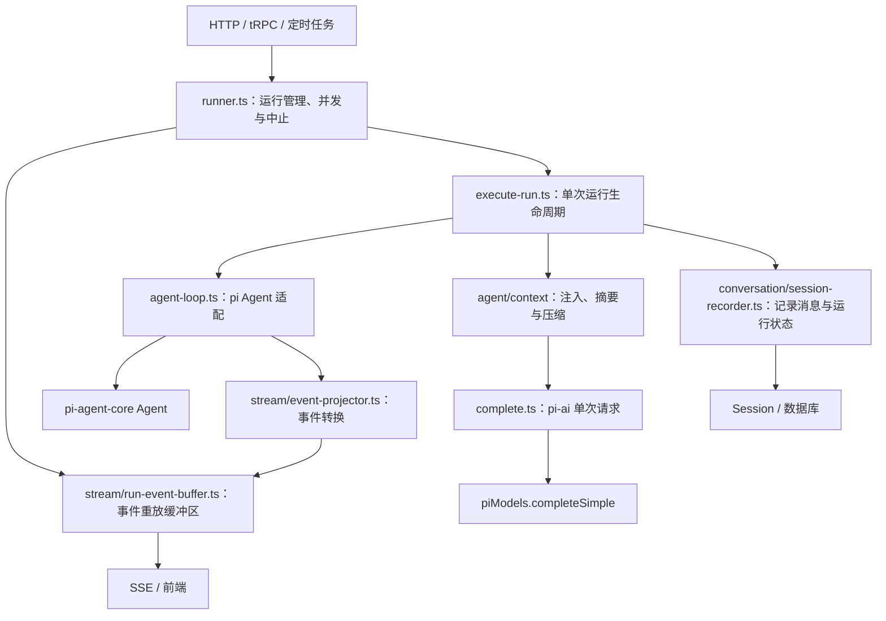

# Agent Runtime

Runtime 的公共入口是 `Runner`。HTTP、tRPC 和定时任务通过它启动、恢复、停止运行或查询状态。

## 职责

| 文件 / 目录 | 负责的事情 |
| --- | --- |
| `runner.ts` | 公共入口与应用生命周期资源：运行注册表、事件缓冲区、取消、后台 shell；同步校验模型；提供 start/resume/settle/compact 等接口 |
| `execute-run.ts` | 单次运行的完整业务流程：装配 context 和工具、打开 session、读取历史、恢复决策、注册 capabilities、订阅、执行、记录与清理 |
| `agent-loop.ts` | 每个实例持有一个 pi Agent；调用方配置 messages、tools、maxTurns；仅负责运行循环 |
| `complete.ts` | 通过 pi-ai completeSimple 执行单次无工具请求，检查错误并提取文本 |
| `capabilities/` | 一个能力实现多个 pi 钩子；compose 将显式注册列表组合为单函数 |
| `tool-resolutions.ts` | 将批准、拒绝、回答落实为暂停工具调用的执行结果 |
| `../skills/scope.ts` | 根据激活 Skill 的 allowed-tools 筛选工具，原 runtime/tool-scope.ts 已合并到这里 |
| `../context/` | 统一拥有上下文变换、注入、摘要、压缩和 token 估算 |
| `stream/` | pi 事件投影、工具错误展示、SSE 编码与内存重放 |
| `test/` | Runtime 测试；`stream/` 测试保留对应层级，上下文测试位于 `agent/context/test/` |

## 生命周期约束

- `start()` 在返回前建立事件缓冲区，调用方可以立即订阅。
- 同一线程已有运行时，新运行被拒绝；不会覆盖原有事件缓冲区或中止句柄。
- `abort()` 发出取消请求。运行完成清理前仍占有线程。
- producer 直接返回执行结果，不再通过外部可变变量传递；成功或失败都会关闭事件流并释放运行注册表。
- `executeRun()` 统一拥有 recorder 的 begin/observe/end，准备失败、模型失败和取消都进入收尾；等待用户时不关闭 operation。
- usage、浮层清理、operation 关闭分别尝试，后一项失败不覆盖原错误；底层存储不可写时保留未结束记录供恢复，并向调用方报告失败。
- `RunResult` 内部分为 completed / waiting / aborted / failed；Runner 仅在公共接口映射成现有 ok/error。messageId 来自实际存储的 assistant 消息，而不是“写过任意数据”。
- `agent_end` 在收尾后发出。后台标题仍可更新会话，但不会在结束后追加流事件；缓冲区也拒绝关闭后的追加。
- `dispose()` 中止当前 Runner 的运行，并阻止它启动新运行。

## 装配边界

`run-coordinator.ts` 已并回 Runner。Runner 不构建工具、不创建 recorder，也不通过 buildTools / generateTitle / onSettled 等回调参与执行。它向 executeRun 传入业务 input、已解析 model、db、projectlessRoot、共享 bgShells，以及 runId / signal / emit。

单次环境在 execute-run 的 `prepareRun` 中顺序组装：创建 sandbox 和 RunContext，再直接 getTools。`prepareMessages` 处理压缩与恢复决策，`reportUsage` 将一次计数映射到前端与账本。它们是同文件的具体步骤，不是额外调度层。capabilities 仍只有一个显式注册区，agent-loop 不承担业务装配。

这里的 Run 指运行到结束或等待用户的一段执行，可以包含多个 pi turn；恢复时沿用原业务 runId，但重新创建 loop。RunContext 是工具环境，不是另一套消息上下文，messages 仍统一使用 pi 类型。

## 事件与持久化

事件缓冲区只保留内存中的流式事件，用于前端重连和增量重放。`session-recorder` 将完整消息、usage 和运行状态写入 Session，供重启后读取。二者的保存目的和生命周期不同。

对外传输仍使用现有 SSE 协议和 `/pi-events` 路由。当前 Hooks 仅供内部可信代码使用，尚未引入用户 Hook 配置或脚本执行器。

会话层测试同样集中在 `conversation/test/`，存储层测试位于其 `store/` 子目录。

`test/runtime.test.ts` 在独立进程运行 runner / execute-run 的 `.cases.ts` 集成用例，使用真实 pi 循环和临时 SQLite session。隔离仅用于避免其他测试的 Electron 部分导出 mock 相互污染，不替换运行管理和持久化逻辑。

## Hooks 边界

同一 Loop 实例的并发执行由 pi Agent 的 `activeRun` 检查拒绝，不再维护额外的 `running` 状态；Loop 只负责外部取消信号的接入与监听清理。

扩展点直接放在 `createAgentLoop` 入参上，不再套 `hooks` 分组。Loop 只接收组合后的单函数，负责轮次上限、取消与执行控制；策略组合由 execute-run 等调用层决定：

- `transformContext`：接收 pi 兼容的单函数。能力组合器内部通过 `composeContext` 组合，不接受 false / undefined 占位；按顺序变换模型输入，复用 context 的错误跳过策略，不改写持久化历史。
- `beforeToolCall`：接收 pi 兼容的单函数。能力组合器内部通过 `tool-checks.ts` 的 `composeBeforeToolCall` 组合检查，按顺序等待执行；遇到 `block` 立即返回原决策（包括 reason / terminate），不再执行后续检查。检查抛错交给 pi 处理，不跳过后继续放行；取消时不启动后续检查。`toolInteractions` 能力内依次检查客户端工具暂停、权限审批，并负责暂停后的停止判断。
- `afterToolCall`：按注册顺序传递修改后的 result 和 isError；仅覆盖明确返回的字段。
- `prepareNextTurn` / `shouldStopAfterTurn`：更新下一轮上下文、模型或决定停止；不能绕过 `maxTurns` 硬上限。达到上限时不再调用停止 Hook。
- `onPayload` / `onResponse`：直接传给 pi 的模型请求扩展点。

所有 Loop 扩展点都接收单函数。主对话在 execute-run、子代理在 subagent/run 各有一份显式能力列表，通过 composeCapabilities 转换；能力工厂不接收整个 Loop 配置，也不隐藏注册其他能力。原 withChatPolicies 已删除。

主对话注册顺序：截图裁剪 → 轮内压缩 → 上下文注入 → 日期提醒 → Skill 工具范围 → 重复检测 → 工具交互。
子代理注册顺序：轮内压缩 → 日期提醒 → 重复检测。两个入口显式设置 maxTurns: 100。

列表顺序只控制同一个钩子内的执行次序，钩子间时机由 pi 控制。prepareNextTurn 顺序传递更新后的 context，model / thinkingLevel 按最后一个明确提供的值合并（pi 的该钩子输入本身不含这两个字段）；停止判断任一返回 true 即停止。上下文变换异常沿用跳过策略，其余决策错误交给 pi，不在组合器中吞掉放行。

Skill 范围每轮从完整工具列表重建，保证退出 Skill 后恢复；重复检测注册在后，达到阈值后持续清空工具，不能被 Skill 恢复覆盖。这一顺序是约束，有回归测试。

Capabilities 只收拢 pi 决策能力。事件投影、会话订阅和收尾是 executeRun 的显式业务步骤；后台 memory/dream 的独立执行入口和审批恢复直接执行工具的路径不经过 capabilities。

暂不提供 TurnHooks：目前没有业务观察者使用整次执行的开始、失败、结束通知。持久化、usage 和清理仍由 `executeRun` 明确执行，不增加空置的生命周期扩展层。

## 上下文类型

Agent 循环、上下文处理、历史修复和会话记录统一使用 pi-agent-core 的 `AgentMessage`，消息内容与 usage 使用 pi-ai 类型。pi 的压缩摘要消息直接传递，不再经过自定义 Message 类型的断言转换；`vocabulary.ts` 已删除。

仅在 token 估算和摘要文本渲染时调用 pi 的 `convertToLlm()`，将扩展消息转换为模型支持的消息。前端事件和展示数据仍在 stream/projector 与 conversation/ui-messages 边界使用应用协议。

## 模型调用与会话辅助能力

- `providers/registry.ts` 提供 `piStreamFn`，供所有 Agent 共享 provider 与 credential store。
- `agent-loop.ts` 只暴露 run 和 subscribe，负责 Agent 工具循环；不提供 complete 或最终文本提取。
- `complete.ts` 的 `complete({ model, system, prompt, signal })` 直接执行单次文本请求，调用共享 `piModels.completeSimple()`，传递 signal、检查 error / aborted 并提取文本。不创建 Agent，不执行工具，也不添加重试或凭证逻辑。
- 标题、权限审核和 `createSummarizer` 使用该单次请求路径；摘要仍由 context 层组装提示词。调用方只传模型，不传 Models 或完成回调；测试在共享 piModels 的请求边界替换实现并及时恢复。
- 聊天与 subagent 显式注册各自能力；摘要不会隐式获得聊天策略。
- `conversation/title.ts` 负责会话标题，`conversation/history.ts` 负责历史工具结果修复；仅用于模型输入的系统提醒位于 `agent/context/system-reminder.ts`。
