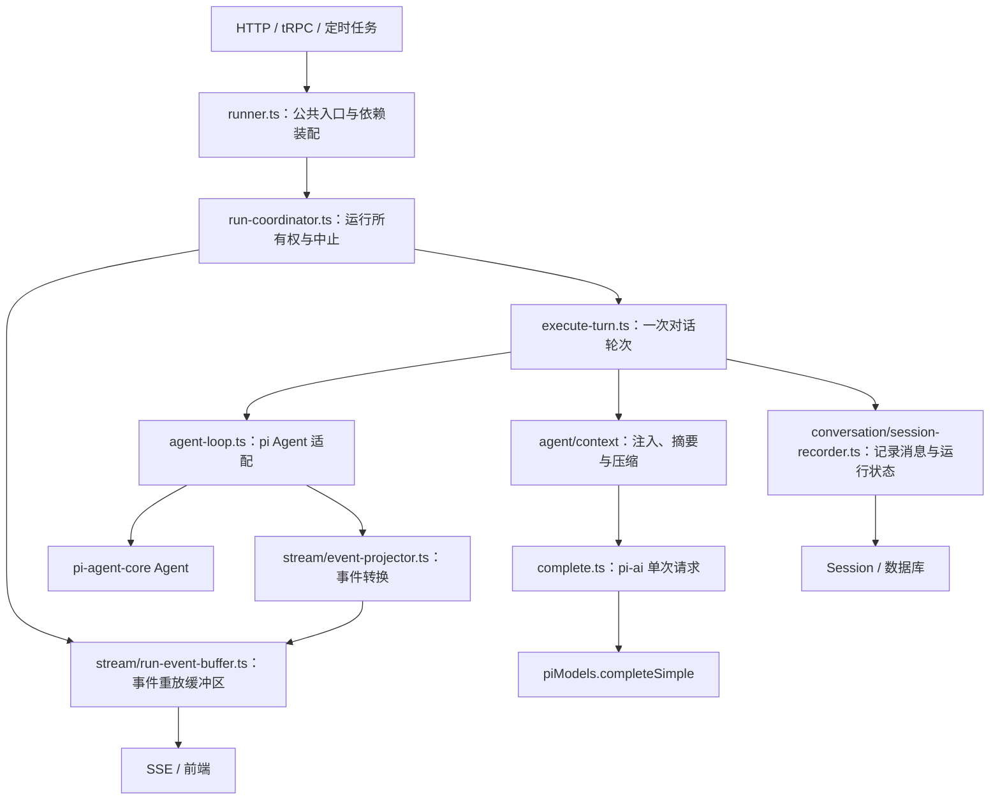

# Agent Runtime

Runtime 的公共入口是 `Runner`。HTTP、tRPC 和定时任务通过它启动、恢复、停止运行或查询状态。



## 职责

| 文件 / 目录 | 负责的事情 |
| --- | --- |
| `runner.ts` | 装配模型、工具、权限、workspace 和持久化依赖；提供 start/resume/settle/compact/abort/subscribe 等接口 |
| `run-coordinator.ts` | 每个 Runner 独立持有运行注册表和事件缓冲区；拒绝同一线程并行启动；在 producer 结束后释放线程 |
| `execute-turn.ts` | 组装上下文、权限门、事件订阅与会话记录；执行 AgentLoop；处理 usage、memory 和最终状态 |
| `agent-loop.ts` | 每个实例持有一个 pi Agent；调用方配置 messages、tools、maxTurns；仅负责运行循环 |
| `complete.ts` | 通过 pi-ai completeSimple 执行单次无工具请求，检查错误并提取文本 |
| `chat-policies.ts` | 聊天与 subagent 显式接入的日期提醒、重复检测和 100 轮上限 |
| `tool-resolutions.ts` | 将批准、拒绝、回答落实为暂停工具调用的执行结果 |
| `../skills/scope.ts` | 根据激活 Skill 的 allowed-tools 筛选工具，原 runtime/tool-scope.ts 已合并到这里 |
| `../context/` | 统一拥有上下文变换、注入、摘要、压缩和 token 估算 |
| `stream/` | pi 事件投影、工具错误展示、SSE 编码与内存重放 |
| `test/` | Runtime 测试；`stream/` 测试保留对应层级，上下文测试位于 `agent/context/test/` |

## 生命周期约束

- `start()` 在返回前建立事件缓冲区，调用方可以立即订阅。
- 同一线程已有运行时，新运行被拒绝；不会覆盖原有事件缓冲区或中止句柄。
- `abort()` 发出取消请求。运行完成清理前仍占有线程。
- producer 成功或失败都会关闭事件流并释放运行注册表；失败继续传给 Runner，由 `RunHandle.settled` 返回错误结果。
- `executeTurn()` 在执行成功或异常后均调用清理回调；清理异常不会覆盖原执行异常。
- `dispose()` 中止当前 Runner 的运行，并阻止它启动新运行。

## 事件与持久化

事件缓冲区只保留内存中的流式事件，用于前端重连和增量重放。`session-recorder` 将完整消息、usage 和运行状态写入 Session，供重启后读取。二者的保存目的和生命周期不同。

对外传输仍使用现有 SSE 协议和 `/pi-events` 路由。当前 Hooks 仅供内部可信代码使用，尚未引入用户 Hook 配置或脚本执行器。

会话层测试同样集中在 `conversation/test/`，存储层测试位于其 `store/` 子目录。

## Hooks 边界

同一 Loop 实例的并发执行由 pi Agent 的 `activeRun` 检查拒绝，不再维护额外的 `running` 状态；Loop 只负责外部取消信号的接入与监听清理。

扩展点直接放在 `createAgentLoop` 入参上，不再套 `hooks` 分组。Loop 只接收组合后的单函数，负责轮次上限、取消与执行控制；策略组合由 execute-turn 等调用层决定：

- `transformContext`：接收 pi 兼容的单函数。调用层通过 `composeContext(ContextTransform[])` 组合，不接受 false / undefined 占位；按顺序变换模型输入，复用 context 的错误跳过策略，不改写持久化历史。
- `beforeToolCall`：接收 pi 兼容的单函数。调用层通过 `tool-checks.ts` 的 `composeBeforeToolCall` 组合检查，按顺序等待执行；遇到 `block` 立即返回原决策（包括 reason / terminate），不再执行后续检查。检查抛错交给 pi 处理，不跳过后继续放行；取消时不启动后续检查。聊天依次检查客户端工具暂停、权限审批。
- `afterToolCall`：保留 pi 的单函数结果修改契约。
- `prepareNextTurn` / `shouldStopAfterTurn`：更新下一轮上下文、模型或决定停止；不能绕过 `maxTurns` 硬上限。达到上限时不再调用停止 Hook。
- `onPayload` / `onResponse`：直接传给 pi 的模型请求扩展点。

所有 Loop 扩展点都接收单函数，数组只出现在调用层使用的组合函数入参中；不引入通用 HookBus 或隐式优先级。`withChatPolicies` 保留调用方的下一轮更新，再应用重复检测与动态工具范围。

```ts
createAgentLoop({
  model, streamFn, systemPrompt, messages, tools, maxTurns,
  transformContext: composeContext([trimScreenshots, foldContext]),
  beforeToolCall: composeBeforeToolCall([parkClientTool, checkPermission]),
});
```

暂不提供 TurnHooks：目前没有业务观察者使用整次执行的开始、失败、结束通知。持久化、usage 和清理仍由 `executeTurn` 明确执行，不增加空置的生命周期扩展层。

## 上下文类型

Agent 循环、上下文处理、历史修复和会话记录统一使用 pi-agent-core 的 `AgentMessage`，消息内容与 usage 使用 pi-ai 类型。pi 的压缩摘要消息直接传递，不再经过自定义 Message 类型的断言转换；`vocabulary.ts` 已删除。

仅在 token 估算和摘要文本渲染时调用 pi 的 `convertToLlm()`，将扩展消息转换为模型支持的消息。前端事件和展示数据仍在 stream/projector 与 conversation/ui-messages 边界使用应用协议。

## 模型调用与会话辅助能力

- `providers/registry.ts` 提供 `piStreamFn`，供所有 Agent 共享 provider 与 credential store。
- `agent-loop.ts` 只暴露 run 和 subscribe，负责 Agent 工具循环；不提供 complete 或最终文本提取。
- `complete.ts` 的 `complete({ model, system, prompt, signal })` 直接执行单次文本请求，调用共享 `piModels.completeSimple()`，传递 signal、检查 error / aborted 并提取文本。不创建 Agent，不执行工具，也不添加重试或凭证逻辑。
- 标题、权限审核和 `createSummarizer` 使用该单次请求路径；摘要仍由 context 层组装提示词。调用方只传模型，不传 Models 或完成回调；测试在共享 piModels 的请求边界替换实现并及时恢复。
- 聊天与 subagent 在外层使用 `withChatPolicies`；摘要不会隐式获得聊天策略。
- `conversation/title.ts` 负责会话标题，`conversation/history.ts` 负责历史工具结果修复；仅用于模型输入的系统提醒位于 `agent/context/system-reminder.ts`。
